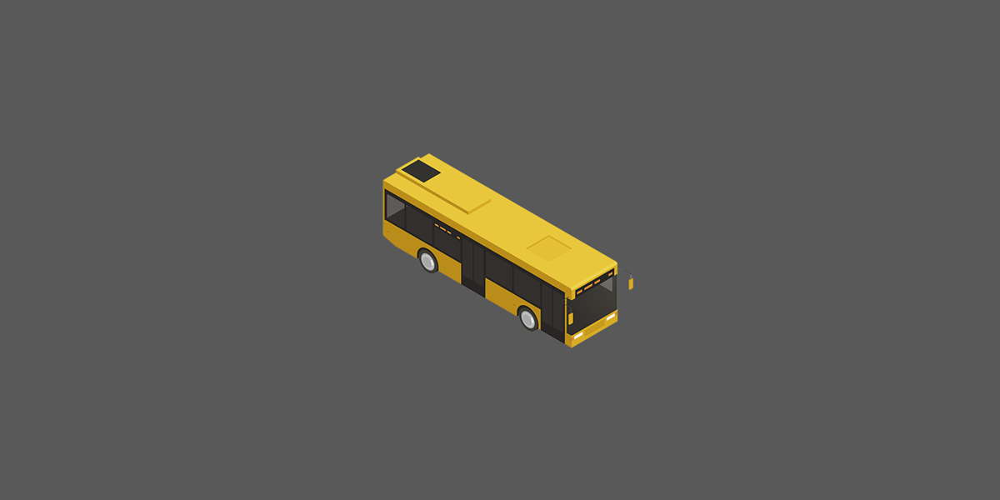
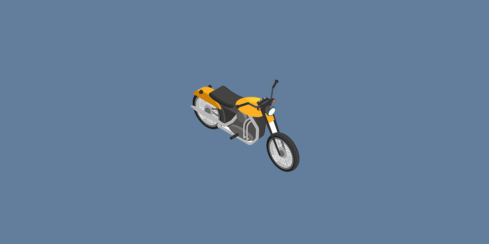
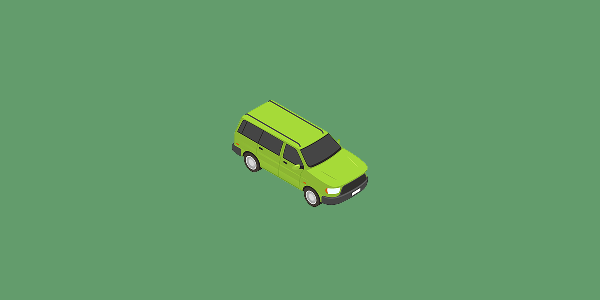

# Carousel(이미지 슬라이드) 만들기

```html
<div style="overflow: hidden">
  <div class="slide-container">
    <div class="slide-box">
      
    </div>
    <div class="slide-box">
      
    </div>
    <div class="slide-box">
      
    </div>
  </div>
</div>
<button class="slide-button">1</button>
<button class="slide-button">2</button>
<button class="slide-button">3</button>
<button class="prev-button">이전</button>
<button class="next-button">다음</button>
```

```css
.slide-container {
  width: 300vw;

  /* 두 번째 이미지 보여줌 */
  /* transform: translateX(-100vw); */

  /* 세 번째 이미지 보여줌 */
  /* transform: translateX(-200vw); */

  transition: all 0.5s;
}

.slide-box {
  width: 100vw;
  float: left;
}

.slide-box img {
  width: 100%;
}
```

```javascript
const slideContainer = document.querySelector('.slide-container');
const slideBoxes = document.querySelectorAll('.slide-box');
const slideButtons = document.querySelectorAll('.slide-button');
const prevButton = document.querySelector('.prev-button');
const nextButton = document.querySelector('.next-button');

let currentImage = 0; // 현재 몇 번째 이미지인지

// 1번 버튼
slideButtons[0].addEventListener('click', function () {
  slideContainer.style.transform = 'translateX(0vw)';
  currentImage = 0;
});

// 2번 버튼
slideButtons[1].addEventListener('click', function () {
  slideContainer.style.transform = 'translateX(-100vw)';
  currentImage = 1;
});

// 3번 버튼
slideButtons[2].addEventListener('click', function () {
  slideContainer.style.transform = 'translateX(-200vw)';
  currentImage = 2;
});

// 이전 버튼
prevButton.addEventListener('click', function () {
  if (currentImage !== 0) {
    currentImage--;
    slideContainer.style.transform = 'translateX(-' + currentImage + '00vw)';
  }
});

// 다음 버튼
nextButton.addEventListener('click', function () {
  if (currentImage !== slideBoxes.length - 1) {
    currentImage++;
    slideContainer.style.transform = 'translateX(-' + currentImage + '00vw)';
  }
});
```
