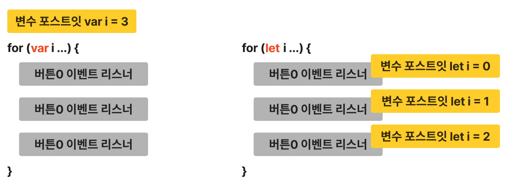

# for 반복문

비슷한 코드를 복붙(반복 실행)할 때 사용

```html
<ul class="tab-list">
  <li class="tab-button">lorem</li>
  <li class="tab-button active">harum</li>
  <li class="tab-button">totam</li>
</ul>
<div class="tab-content">
  <h3>lorem</h3>
  <p>lorem ipsum dolor sit</p>
</div>
<div class="tab-content show">
  <h3>harum</h3>
  <p>harum sapiente, tempore, a alias repellat corporis</p>
</div>
<div class="tab-content">
  <h3>totam</h3>
  <p>totam laborum modi architecto iure at iste?</p>
</div>
```

```css
.tab-list {
  padding: 0;
  margin: 0;
  list-style: none;
  background: #eeeeee;
  border-bottom: 2px solid #d2d2d2;
  display: flex;
}

.tab-button {
  padding: 10px 20px;
  cursor: pointer;
}

.active {
  background: #d2d2d2;
}

.tab-content {
  padding: 0 15px;
  display: none;
}

.show {
  display: block;
}
```

```javascript
const tabButtons = document.querySelectorAll('.tab-button');
const tabContents = document.querySelectorAll('.tab-content');

// tabButtons[0].addEventListener('click', function () {
//   tabButtons[0].classList.remove('active');
//   tabButtons[1].classList.remove('active');
//   tabButtons[2].classList.remove('active');
//   tabContents[0].classList.remove('show');
//   tabContents[1].classList.remove('show');
//   tabContents[2].classList.remove('show');

//   tabButtons[0].classList.add('active');
//   tabContents[0].classList.add('show');
// });
// ...
// tabButtons[2].addEventListener('click', function () {
//   tabButtons[0].classList.remove('active');
//   tabButtons[1].classList.remove('active');
//   tabButtons[2].classList.remove('active');
//   tabContents[0].classList.remove('show');
//   tabContents[1].classList.remove('show');
//   tabContents[2].classList.remove('show');

//   tabButtons[2].classList.add('active');
//   tabContents[2].classList.add('show');
// });

// for (횟수) { 복붙(반복 실행)할 코드 }
for (let i = 0; i < 3; i++) {
  // 확장성 => i < tabButtons.length로 작성
  tabButtons[i].addEventListener('click', function () {
    tabButtons[0].classList.remove('active');
    tabButtons[1].classList.remove('active');
    tabButtons[2].classList.remove('active');
    tabContents[0].classList.remove('show');
    tabContents[1].classList.remove('show');
    tabContents[2].classList.remove('show');

    tabButtons[i].classList.add('active');
    tabContents[i].classList.add('show');
  });
}

// 실행 횟수     변수 i     조건 i < 3      복붙(반복 실행) 여부
// 1           0         true           O
// 2           1         true           O
// 3           2         true           O
// 4           3         false          X
```

<br />

**(참고) var 대신 let 쓰는 이유**

```javascript
for (let i = 0; i < 3; i++) {
  tabButtons[i].addEventListener('click', function () {
    tabButtons[0].classList.remove('active');
    tabButtons[1].classList.remove('active');
    tabButtons[2].classList.remove('active');
    tabContents[0].classList.remove('show');
    tabContents[1].classList.remove('show');
    tabContents[2].classList.remove('show');

    tabButtons[i].classList.add('active');
    tabContents[i].classList.add('show');
  });
}
```

컴퓨터는 코드를 위에서부터 한 줄씩 해석

1. for 반복문 발견, 안에 있는 코드를 반복 실행하려 함
2. 이벤트 리스너를 만남, 안에 있는 코드는 바로 실행하지 않고 지나감
3. 반복문 안에 있는 코드 3번 실행
4. 반복문 끝나서 var i 변수의 값는 3이 되어 있음
5. 이벤트가 발생하면 안에 있는 코드 실행
6. i라는 변수 발견, 컴퓨터는 변수를 발견하면 근처에서 변수를 찾아서 채우려고 함
7. tabButtons[3]은 존재하지 않음
8. 에러 발생

<br />

**for 안에서 var i = 0 사용 시**  
var 변수는 범위가 function(함수)  
var i 들어있는 포스트잇은 for 바깥에 생성

**for 안에서 let i = 0 사용 시**  
let 변수는 범위가 {}(블록)  
let i 들어있는 포스트잇은 for 안쪽에 3개 생성


