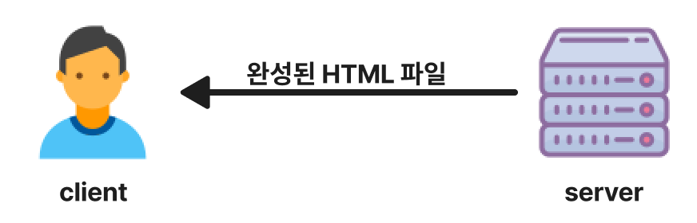

# SSR(Server-Side Rendering) & CSR(Client-Side Rendering)

웹 서비스 개발 방식

## SSR(Server-Side Rendering)

서버에서 HTML을 미리 완성해서 클라이언트로 보냄

## CSR(Client-Side Rendering)

서버에서 빈 HTML 파일과 데이터를 보냄  
받은 데이터를 갖고 JavaScript로 HTML 완성

